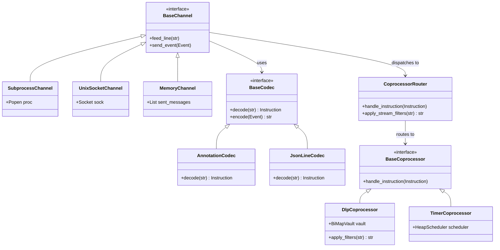

# Engineering Notes: Decoupled Interposition Architecture: Transports, Codecs & Coprocessor Reactor
**Date:** 2026-09-18  
**Topic:** Architectural Decoupling, Transport Agnosticism, Codec & Framing Layers, Coprocessor Reactor, Out-Of-Band IPC, Golden Paths  
**Format:** Direct architecture notes (English, non-fluff, systems engineering & layered taxonomy)

---

## 1. Executive Summary & The Core Thesis

### The Channel-Coupling Trap
In early iterations of stream supervisors, the control plane (IPC) and data plane (stream payload) are frequently hardcoded to a single channel—typically in-band annotations (`# @harness...`) embedded directly in `stdout`.

While in-band annotation is an optimal strategy for zero-SDK shell scripts and black-box CLI binaries, **treating annotations over standard I/O as the sole identity of `fd-harness` is an architectural category error**.

### The True Abstraction: Stream Interposition Microkernel
Fundamentally, `fd-harness` is a **modular, reactive interposition microkernel** composed of three strictly orthogonal tiers:
1. **Transport Layer** ($T$): *Where do bytes originate and terminate?* (Pipes, Extra FDs, Unix Domain Sockets, FIFOs, Sockets, In-Memory).
2. **Codec & Framing Layer** ($C$): *How are control intentions and payloads serialized/demuxed?* (In-Band Text Comments, JSONL, Protobuf, Static TOML Injection).
3. **Reactor & Coprocessors** ($R$): *How do domain engines maintain state and mutate streams?* (Router, Scheduler, DLP BiMap Vault, Timers).

```
   Raw Bytes / Signals               Typed Instructions                Stream Mutations & IPC
┌─────────────────────────┐       ┌───────────────────────┐       ┌────────────────────────────┐
│ 1. TRANSPORT LAYER      │  ───▶ │ 2. CODEC / FRAMING    │  ───▶ │ 3. REACTOR & COPROCESSORS  │
│ (Pipes, FDs, UDS, FIFO) │       │ (In-Band, JSONL, TOML)│       │ (Router, Vault, Scheduler) │
└─────────────────────────┘       └───────────────────────┘       └────────────────────────────┘
```

---

## 2. The 3-Tier Layered Architecture

```
┌─────────────────────────────────────────────────────────────────────────────┐
│ 1. TRANSPORT & CHANNEL LAYER (Physical / OS I/O Boundary)                   │
│                                                                             │
│  • Standard Streams (Pipes 0, 1, 2) → Default subprocess & CLI pipe mode    │
│  • Dedicated File Descriptors (FD 3+) → Out-of-band side-channel (No stdout poll)│
│  • Unix Domain Sockets (AF_UNIX)   → High-throughput local IPC (Python/Go) │
│  • Named Pipes / FIFO (ConfigFS)   → Asynchronous external control injection│
│  • Network Sockets (TCP/WS/gRPC)   → Distributed / Remote topology meshes   │
│  • MemoryChannel (RingBuffers)     → Deterministic, sub-millisecond testing │
└──────────────────────────────────────┬──────────────────────────────────────┘
                                       │ Raw Bytes / Lines
                                       ▼
┌─────────────────────────────────────────────────────────────────────────────┐
│ 2. CODEC & FRAMING LAYER (Protocol & Demuxing)                             │
│                                                                             │
│  • AnnotationCodec (# @harness...) → Demuxes control & data on single stream│
│  • JsonLineCodec ({"cmd": ...})    → Structured microservice RPC            │
│  • Binary / Length-Prefixed Codec  → Ultra-low overhead, binary payloads    │
│  • Static Config Injection         → Pre-injected TOML/CLI rules (Golden)   │
└──────────────────────────────────────┬──────────────────────────────────────┘
                                       │ Strongly Typed Domain Instructions
                                       │ (FilterMask, TimeRequest, DlpMutate)
                                       ▼
┌─────────────────────────────────────────────────────────────────────────────┐
│ 3. REACTOR & COPROCESSOR LAYER (Domain State & Stream Mutation)             │
│                                                                             │
│   [ CoprocessorRouter ]                                                     │
│     ├── Stream Mutation Pipeline   → Live line rewrites, masking, aliasing  │
│     ├── DlpCoprocessor             → BiMapVault, WAL persistence, HMAC/Seq  │
│     ├── TimerCoprocessor           → HeapScheduler, virtual discrete clocks│
│     ├── ChaosCoprocessor (Future)  → I/O latency injection, fault simulation│
│     └── TelemetrySink (Future)     → Prometheus / OpenTelemetry exporters   │
└─────────────────────────────────────────────────────────────────────────────┘
```

---

## 3. Workload Persona & Interaction Patterns Matrix

| Persona / Context | Transport ($T$) | Codec ($C$) | Characteristics & Trade-offs |
| :--- | :--- | :--- | :--- |
| **A. Black-Box Legacy / Bash Scripts** | Standard Pipes (`FD 1` / `stdout`) | `AnnotationCodec` (`# @harness...`) | **Zero-SDK / Zero-Touch.** Application uses simple `echo` / `print`. Control directives are intercepted and stripped from output before reaching external consumers. |
| **B. White-Box Services (Python, Go, Rust)** | Dedicated `FD 3` or Unix Domain Socket (`/tmp/harness.sock`) | `JsonLineCodec` (`{"action": ...}`) | **Clean Separation.** `stdout` remains 100% pristine application business logs. Control plane operates out-of-band over a dedicated structured stream. |
| **C. Standalone Golden Paths (DLP Redact, Unmask)** | CLI Arguments / TOML / `stdin` Pipe | Static Rule Injection (No runtime IPC) | **Frugal Streaming Filter.** No IPC during execution. Rules pre-loaded into router at boot. Zero regex parsing overhead for control frames. |
| **D. External Control / Sysfs Style** | Named Pipe (`FIFO /tmp/harness.ctl`) | Text / JSON Directives | **Asynchronous Live Control.** External operators or orchestrators inject rules at runtime (`echo "mask:..." > /tmp/harness.ctl`) without process restart. |
| **E. Headless Unit Tests & Virtual Sim** | In-Memory (`MemoryChannel`) | Programmatic / Direct | **Deterministic Testing.** 39+ tests execute in $<60\text{ms}$ with virtual discrete time and zero OS subprocess forks. |

---

## 4. Layer Separation Specifications

### 4.1. Tier 1: Transport & Channel Abstraction (`BaseChannel`)
A channel abstracts the physical transfer of octets between the supervisor and the managed environment:

$$\text{Channel} : (\text{Ingress Stream}) \to \text{Egress Stream}$$

- **Contract:**
  - `feed_line(raw: str) -> None`: Ingests incoming lines from the target source.
  - `send_event(event: Event) -> None`: Emits response events (e.g., writing back to child's `stdin` or socket).
  - `is_active() -> bool`: Reports whether the underlying transport is healthy.
- **Implementations:**
  - `SubprocessChannel`: Wraps `subprocess.Popen` stdio pipes with non-blocking POSIX `select` loops.
  - `UnixSocketChannel`: Listens on an `AF_UNIX` stream socket.
  - `MemoryChannel`: In-memory queues for deterministic testing without I/O syscalls.

### 4.2. Tier 2: Codec & Serialization (`BaseCodec`)
A codec defines how raw strings or byte frames are mapped to domain-specific `Instruction` objects:

$$\text{Codec} : \text{Raw String} \to \text{Optional}[\text{Instruction}]$$

- **Contract:**
  - `decode(line: str) -> Optional[Instruction]`: If the line contains a valid control instruction, returns the parsed model; otherwise returns `None` (signaling pure stream payload).
  - `encode(event: Event) -> str`: Serializes outgoing event models back into transport-specific syntax.
- **Implementations:**
  - `AnnotationCodec`: Matches `# @harness.<domain>:<action> key=val` regexes. Strips matched lines from data stream.
  - `JsonLineCodec`: Parses JSON objects (`{"domain": "filter", "action": "mask", "pattern": "..."}`).

### 4.3. Tier 3: Reactor & Coprocessor Layer (`CoprocessorRouter`)
The core microkernel engine is **completely decoupled from both Transport and Codec**:

$$\text{Router} : \text{Instruction} \to \text{Coprocessor State Mutation}$$

- The router maintains a registry of domain coprocessors (`TimerCoprocessor`, `DlpCoprocessor`).
- Coprocessors register stream mutation hooks (`Callable[[str], Optional[str]]`) into the `CoprocessorContext`.
- When payload data passes through the engine, active filters mutate the line sequentially before output.
- **Crucial Invariant:** The `CoprocessorRouter` and `DlpCoprocessor` do not know whether an instruction was parsed from an in-band comment, a JSON Unix socket, or a static TOML file.

---

## 5. Architectural Benefits



1. **Zero-Overhead Golden Paths**: Subcommands like `fd-harness dlp redact` skip in-band parsing entirely. The pipeline reads input lines and executes regex substitutions directly through the `DlpCoprocessor` filter pipeline without control-plane overhead.
2. **Language-Agnostic Extensibility**: Adding support for a Python service emitting JSON on `FD 3` requires only writing a small `JsonLineCodec` and opening descriptor 3. The entire DLP engine, BiMap vault, and timer scheduler remain 100% untouched.
3. **Deterministic Sandboxed Verification**: The entire system can be embedded inside external test harnesses, simulations, or CI pipelines without spawning actual OS processes.

---

## 6. Future Expansion Roadmap

1. **Phase II.A: Dedicated File Descriptor Channel (`--control-fd <N>`)**:
   - Allows guest processes to write structured JSON control directives to `FD 3` or `FD 4`, keeping `stdout` completely clean for business payloads.
2. **Phase II.B: Unix Domain Socket Server (`--ipc-socket <path>`)**:
   - Opens `/tmp/harness-<pid>.sock` to accept external control commands and emit real-time audit metrics to external sidecars.
3. **Phase II.C: FIFO Control Node (`--control-fifo <path>`)**:
   - Dynamic non-blocking command injection via standard Unix named pipes (`sysfs`/`configfs` style).

